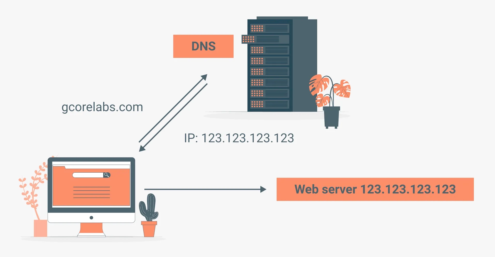
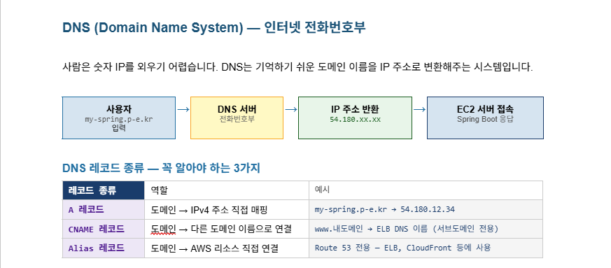
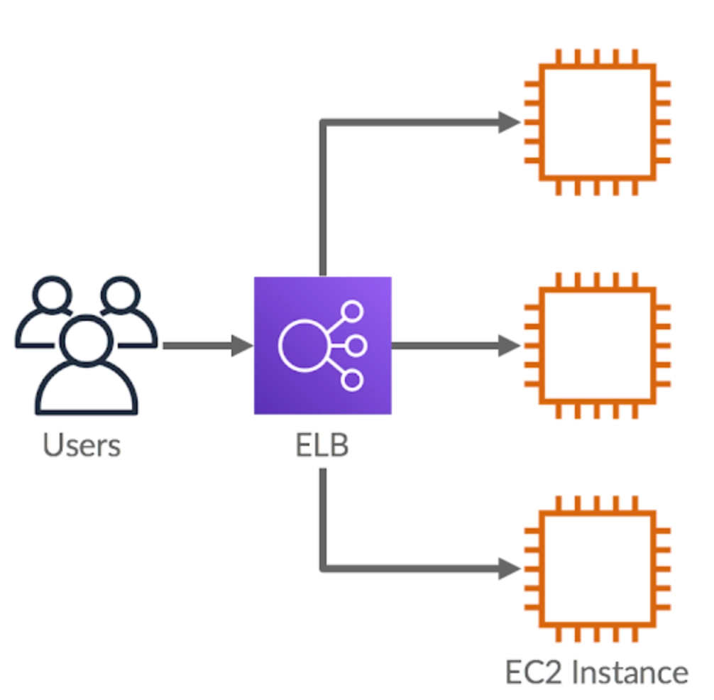

스프링 프로젝트 자체는 80으로 들어온다는 거지
443은 프론트엔드에서 백엔드로 간다는 것<br>
결론만 따지면 port: 80말고 다른걸 추가할 필요가 없다는 거지

# Domain 개념
## 현재 수업 상황에서 복습에서 삭제하라고 했던 EC2 다시 살려서 탄력적 IP 연결까지 완료

## 필수 개념 수업
### 도메인(domain)
naver.com / toutube.com과 같이 **문자로 만들어진 컴퓨터 주소**를 의미한다. IP 개념을 배웠으니까, IP도 컴퓨터 주소였지만 그건 숫자로 이루어진거고, 얘는 문자열을 만든 다음에 우리 IP주소와 매핑을 시켰다고 볼 수 있다.

1. 서브 도메인(Sub Domain)
naver를 예시로 들면 naver.com도 있고 map.naver.com/ search.naver.com과 같은 주소를 확인할 수 있다. 즉, `_.naver.com` 형태의 도메인을 서브 도메인이라고 칭한다. 그리고 그 정의는 **하나의 도메인 _아래_ 에서 여러 서비스를 구분하여 관리** 할때 사용한다.
서브 도메인들은 각각 따로 구매하는 것이 아니라 naver.com 하나 구매하면 모든 서브 도메인이 이용가능하다.

- 실무에서의 서브도메인 활용 방안
  - 서브 도메인은 메인 웹 사이트, 관리자 웹 사이트, 백엔드 서버 등의 구성 요소를 구분하기 위해 활용하는 편이다. 예를 들어 tmdzm.kr이라고 하는 도메인을 구매했다고 가정했을 떼, 메인 웹 사이트는 tmdzm.kr이고, 관리자용 웹 사이트 도메인으로 admin.tmdzm.kr이고, 백엔드 서버의 도메인으로는 api.tmdzm.kr이 되는 방식이 될것이다.

### 웹 서비스에 도메인을 적용하는 이유
웹 사이트는 데이터를 받아오기 위해 백엔드의 api와 통신하는 경우가 많다. 그러면 EC2로 올리는 것까지 배웠으니까 그냥 탄력적 ip로 받아오면 되지 않나 라고 생각할 수 있다.<br>
근데 실무에서는 대부분 도메인 주소로 연결해준다.<br>
일단 기억하기 쉽다. 더 중요한 실무적인 이유로는 HTTPS 적용을 하기 위해서이다. 일반적인 IP 주소로는 HTTPS를 적용할 수 없으므로 실무에서 서비스 운영할 때는 도메인 적용이 사실상 필수적이다.

### DNS(Domain Name System)
**도메인 주소를 IP 주소로 변환하는 시스템** : 사람은 문자열 주소값을 더 잘 외울 것이고, 컴퓨터는 IP 주소를 더 잘 처리할 거니까 중간에 변환해주는 체계를 만들자 -> DNS



1. DNS 레코드<br>

오늘 수업에선 A레코드만 쓸것이지만, 3개다 중요하다.

- 내도메인.한국의 경우 서브 도메인--

## ELB 이해하기
### HTTP vs. HTTPS
RESTful API에서 공부했던 것처럼 대부분의 웹 사이트는 HyperText Transfer Protocol이라는 방식으로 서버와 데이터를 주고 받는다.(그리고 그 중개 역할을 하는 데이터 폼이 JSON이었다.) HTTP는 주고 받는 데이터를 암화하하지 않기 때문에 중간에 데이터를 가로채는게 가능했다.<br>
예를 들어 로그인하려고 했을 때 아이디와 비밀번호를 백엔드 서버로 보내게 될텐데, 해커가 이를 가로채는게 가능했다.
우리는 암호화를 백엔드에서 DB로 보낼때만 했으니까

이런 보안 문제를 해결하기위해 나온게 HTTPS이다

### HTTPS 적용 이유
1. 보안강화 : HTTPS 적용을 하면 데이터를 암호화해서 통신하기 때문에 추가 작업이 필요하다. 백엔드 서버의 주소도 HTTPS 인증을 받아야한다. 따라서 데이터를 안전하게 주고받을 수 있도록 FE-BE서버 모두 HTTPS를 적용한다.
2. SEO(Search Engine Optimization): 구글이나 네이버 같은 검색 엔진에서 HTTPS 적용하면 상위 노출점수를 좀더 준다.
3. 사용자 이탈 방지 : 주소창 좌측 보면 https 적용 안되어 있으면 크롬에서 warn 띄운다. 신경쓰는 사람도 있고 아닌 사람도 잇다.

### ELB(Elastic Load Balancing)
AWS에서 제공하는 로드 밸런서 서비스를 의미한다. 그러면 로드 밸런서가 뭐냐면 트래픽을 여러 서버에 걸쳐 분산하는 장치로, 특정 서버에 트래픽이 집중되는 것을 방지하고, 장애가 발생하더라도 정상적인 서버로 트래픽을 전달할 수 있도록 한다. 즉, 같은 역할을 하는 서버를 2대 이상 복수로 운영하는 경우 안정된 서비스를 제공하기 위해 ELB를 도입한다.<br>
또한 ELB에서는 특정 포트에서 HTTPS 요청을 처리하도록 설정할 수 있으므로 보안이 필요한 웹사이트나 API 서버에서도 많이 사용하게 된다.(그래서 HTTPS 배우면서 ELB가 단원으로 함께 구성했었다.)

### ELB의 구성 요소
1. 리스너(listner) : ELB로 들어오는 요청을 어떻게 처리할지 결정하는 규칙. 특정 포트와 프로토콜을 이용하여 클라이언트의 요청을 기다리고, 해당 요청을 ELB에서 설정된 규칙에 따라 적절한 _대상 그룹_ 으로 전달해준다. 예를 들어서 HTTPS 프로토콜을 사용하는 리스너는 443포트에서 보안 연결을 통해 들어오는 트래픽을 받아서 암호화된 상태로 처리해준다. 리스너를 잘못 설정하면 요청을 올바른 대상 그룹으로 전달하지 못하므로 리스너 설정에 주의를 해줘야 한다.

2. 대상 그룹 : ELB가 수신한 트래픽을 전달할 서버들의 집합을 의미한다. 즉 ELB로 들어온 요청을 어디로 보낼지 결정해야 하는데, 그 어떤 곳들을 대상 그룹으로 볼 수 있다.<br>
즉, ELB에 EC2 인스턴스를 추가한다면 ELB느 들어온 요청을 Ec2 인스턴스로 전달하게 된다. 근데 EC2에 오류가 발생해서 서버가 멈췄다고 가정해보자. 그러면 보내봤자 쓸모 없을 것이기 때문에 ELB는 대상 그룹 내에 있는 EC2 인스턴스들이 살아있는지 확인하기 위해 주기적으로 요청을 보내본다. 그 때 200 ok가 리턴되면 살아있다고 보고 요청을 해당 인스턴스에 보내게 되고, 만약에 200 ok가 리턴되지 않는 다면 그 인스턴스에는 요청을 보내지 않는 **상태검사(health check)**도 수행해주는 기능이 있다. 대상 그룹을 만들 때 상태 검살르 할 경로와 포트를 지정해준다.

ELB 개념 이미지



동일한 역할을 하는 ec2 instance 3개<br>
user는 ec2에 바로 연결하는게 아니라 ELB에 먼저 연결되어 ELB가 ec2들의 상태를 체크해서 어느 ec2 인스턴스에 연결시킬건지 정해준다.

## nginx를 도입하여 HTTPS 적용하기
- 현재 server port를 80으로 잡아놨는데, nginx가 80을 정유한다. 그래서 serverport를 8080으로 수정해야 할것 같다.

- 그리고 고려해야할것이

라는 것이다.<br>
보안 규칙으로 80이 잡혀있으니 -> 8080으로 바꾸면 오류나는것 아닌가 -> 정답

그런데 위에서 설명한 것처럼 80 포트를 통해서 바로 ec2로 들어가는 게 아니라 먼저 nginx를 통해서 들어오게 될것이다. 그러면 보안 규칙상 80은 열려있으니까 nginx까지는 들어가게 될거고, nginx에서 8080으로 보내줄거기 때문에 aws 상의 ec2 보안 규칙에 위배되지 않는다.

`sudo apt install -y nginx`로 설치한뒤<br>
`nginx -v` 또는 -version으로 설치확인 가능<br>

`sudo tee /etc/nginx/sites-available/springboot` : Springboot 프로젝트를 Nginx 설정 파일을 생성하는 명령어이다.
- /ect/nginx/sites-available/ 경로에 springboot라는 이름의 설정 파일을 생성한다는 의미이다.
- sudo tee : 사용자 권한이 필요한 디렉토리에 대고 내용을 직접 덮어쓰도록 작성.
- 그러고 엔터를 치니까 아무런 메시지가 없고 커서 깜빡임. 이제 이 이후에 쓰는 내용의 입력을 기자리는 입력 상태가 된다.

```
server {
  listen 80;
  server_name api.tmdzm-springboot.p-e.kr;

  location /{
    proxy_pass http://localhost:8080;
    proxy_set_header Host $host;
    proxy_set_header X-Real-IP $remote_addr;
    proxy_set_header X-Forwarded-For $proxy_add_x_forwarded_for;
    proxy_set_header X-Forwarded-Proto $scheme;
  }
}
```
- 왜 갑자기 localhost인가?
- ec2는 컴퓨터 한대인 상황
- 이 컴퓨터내에서 실행중인거라 localhost이며, port를 8080으로 잡아서 8080이다.

- 복사 붙여넣으니까 2번씩 들어간다.

- 그냥 깜빡거리고 대기로 들어가서 수정하겠다.
`sudo nano /etc/nginx/sites-available/springboot` : 바로 편집기 진입

- sudo : 관리자 권한으로 실행
- nano : 리눅스에서 텍스트 편집할 때 쓰는 텍스트 편집기 실행
- /etc/nginx/sites-avaliable/springboot : 이 경로의 spingboot 파일을 새로 만들거나 수정하겠다.


- 이후 다시 server{~~}를 넣음
- ctrl + x: 저장, => y이후 엔터

```bash
sudo ln -s /etc/nginx/sites-available/springboot /etc/nginx/sites-enabled/
sudo rm -f /etc/nginx/sites-enabled/default
sudo nginx -t && sudo systemctl restart nginx
```

1. sites-available에 있는 springboot 파일을 sites-enabled로 심볼릭 링크를 만들어준다.
  - 이유 : Nginx가 sites-available에 있는걸 그대로 실행 못 시키고 enabled에 있는 파일만 읽어서 서버를 돌리기 때문이다.(보안문제때문...) 원본은 sites-available이라는 원본 보관소에 두고, 필요할 때만 바로가기를 통해 해당 설정을 쓰겠다는 의미로 볼 수 있다.

2. /etc/nginx/sites-enabled 경로에 default라는 파일이 있다. Nginx 기본 설정이라 볼 수 있는데, 이걸 삭제해서 우리는 springboot(파일명임) 설정을 쓰겠다는 뜻이다.

3. sudo nginx -t : 오타나 문법 상 오류 없는지 테스트 하라는 것이다.
  - sudo systemctl restart nginx : nginx다시 시작하라는 것

`nginx: configuration file etc/nginx/nginx.conf test is successful`이라고 나왔다면 성공

## NginX
Springboot를 실행할 때 유심히 봤거나, 전공자는 Apache를 본적이 있을것이다.(톰캣이나)<br>
Nginx는 웹 서버이자 클라이언트 요청을 백엔드로 연결시켜주는 리버스 프록시 서버에 해당한다.<br>
손님(사용자)과 주방(springboot 프로젝트)사이에서 주문을 효율적으로 관리하고 음식을 서빙하는 녀석이다.

### 사용이유
1. 리버스 프록시 : 보안을 위해 사용자가 실제 애플리케이션 서버(우리기준 8080)에 직접 접근하지 못하게 막고, 자기가 받아서 토스해주는 역할을 함.
2. 로드밸런싱 : ELB라는 것은 AWS에서의 서비스 명이고 load balancig 개념 자체는 다른 데서도 쓰인가. 접속자가 너뭄 낳을 때 여러 대의 서버로 요청을 분산시켜서 서버 다운을 방지하고, 서버 다운 되면 다른 데로 보내주는 등의 역할을 한다.
3. 정적 파일 처리 : 기본적으로 static 폴더내에 있는 HTML / CSS / 이미지 등에 있는 변하지 않는 정적 파일들을 애플리케이션 서버를 거치지 않고 직접 응답시켜줘서 효율을 높일 때 사용.
(resources/static 건드린적 있음 -> 근데 우린 react써서 상관없)
4. SSL(HTTPS) 설정 : 보안 인증서 적용 작업을 nginx 내에서 처리할 수 있다.

### 기존 서버(Spring(boot)의 Apache)와의 차이점
- nginx는 비동기 이벤트 기반 방식을 사용하여 효율성을 높이고 이상에서의 특징들을 적용할 수 있기 때문에 최근에는 채용한다. 다만 초반 설정 때문에 springBoot의 기본 Web server는 여전히 Apache이다.

### 이제 nginx가 적용되어있는 상태에서 http://요청이 들어가는지 체크

여기서 다시 ./gradlew clean build로 다시 빌드한뒤<br>
sudo java -jar aws-ec2-springboot-0.0.1-SNAPSHOT.jar로 실행해서
화이트 라벨이 나오는지 확인

### HTTPS 적용
Certbot 설치 + HTTPS 발급
certification bot

```bash
sudo snap install --classic certbot
sudo ln -s /snap/bin/certbot /usr/bin/certbot
sudo certbot --nginx -d api.tmdzm-springboot.p-e.kr
```
usr은 오타가아니라 진짜 e가 없다.

1. sudo snap install --classic certbot : snap 패키지 매니저를 통해서 certbot 프로그램 설치
  - certbot : 무료 SSL 인증서를 발급해주고 nginx 설정을 _자동 수정_ 해서 HTTPS를 적용시켜준다. --classic은 시스템 접근 권한 준다는 뜻

2. sudo ln -s /snap/bin/certbot /usr/bin/certbot : 두개의 경로 적힌 것에서 볼 수 있듯이 실행 파일을 /usr/bin/으로 바로가기를 만드는 것
  - 터미널 어느 링크든지간에 상관없이 certbot 명령어 실행시킬 수 있도록 바로가기 만드는 것

3. sudo certbot --nginx -d api.tmdzm-springboot.p-e.kr : sudo 권한으로 certbot 실행시키는데, `--nginx`를 통해서 nginx 설정 파일을 **알아서 HTTPS로 수정해라**는 의미. `-d 도메인주소`는 인증서 받을 도메인 주소를 지정한다.(우리는 현재 서브 도메인에 탄력적 ip를 연결해놔서 이렇게 했다.) -> 그럼 프론트엔드는? 프론트엔드는 정적 페이지 배포를 통해서 별개의 도메인을 발급 받는다.

1. Email address 질문이 있다. : 이메일 입력후 엔터함
2. Terms of Service : 약관, 동의, 그냥 y 누르기
3. 특정 회사에 이메일 공유할거냐? 공유하는 순간 광고 옴 : n 

이후 또 빌드...할 필요는 없다. nginx는 뭐가 다르길래?
- springboot 프로젝트를 수정한게 아니라 EC2 내부에 있는 nginx 파일만 수정한거니까

그래서 certificate가 통과되면 https://api.~가 접속이 가능해야한다.

이제 뭘 해야할까 -> 다 지워야 한다. 돈내기 싫으면

- 내일 새로운 방식으로 springboot 프로젝트를 실행할 예정이다. 차이점은 터미널을 거도 springboot 프로젝트가 켜져 있는지 아닌지의 여부, 현재 sudo로 실행할 경우
--