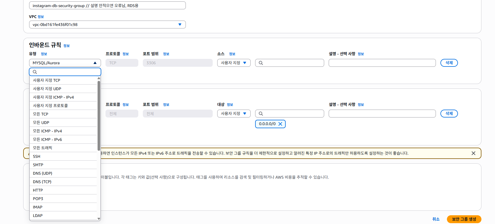
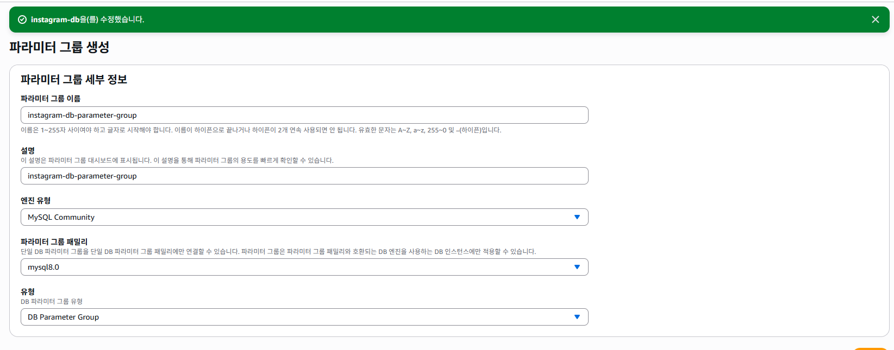
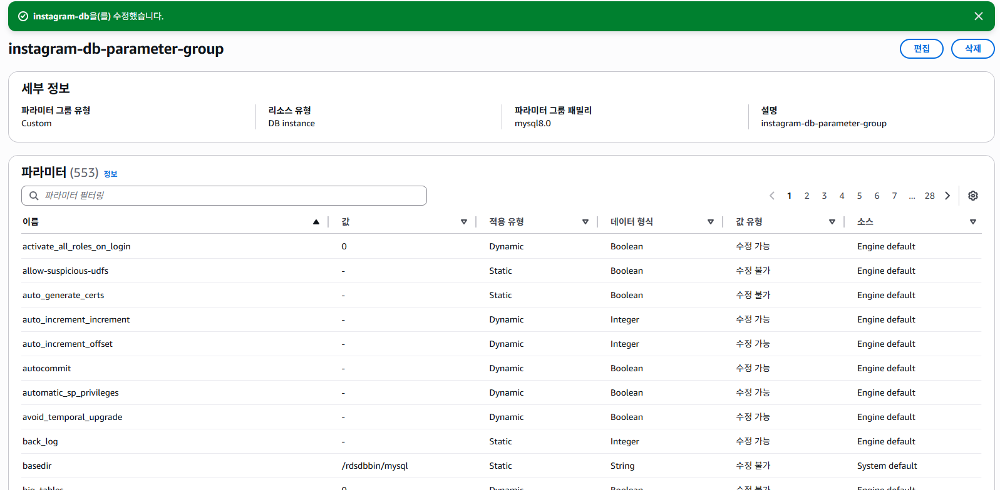
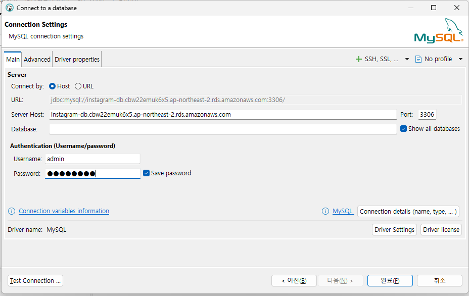
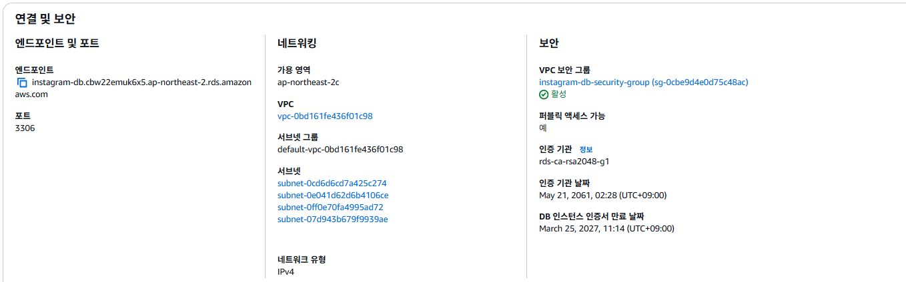
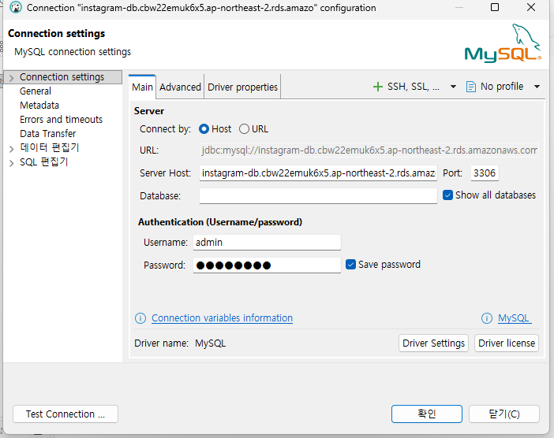

# RDS 란 ?
## RDS
Relational Database Service의 축약어로 AWS 상에서 **관계형 데이터베이스를 빌려서 사용할 수 있는 서비스**. 내부에 MySQL / MariaDB도 있고, PostgreSQL 등 다양한 DB를 제공하며, 사용자강 ㅝㄴ하는 유형을 선택해서 사용할 수 있다. DB를 안정적으로 유지보수할 수 있도록 백업 / 업데이트/ 자동 확장 기능을 제공해준다.

## RDS 인스턴스
AWS로부터 빌린 DB가 설치되어있는 컴퓨터 한 대를 RDS 인스턴스라고 한다. EC2와 같다.
- 우리는 localhost로 실행할 때 컴퓨터 한 대에서 backend 서버와 DB를 동시에 돌렸는데, 그 말은 EC2 내부에 DB를 설치해서 사용하는 방법이 있지 않을까? -> 가능
- 이유는 이하에서 설명

 RDS는 세 가지 옵션을 설정할 필요가 있다.
 1. 엔진 유형 : DB 종류ㅜ라고 생각하면편하다. 주요 데이터베이스의 엔진은 MySQL, MariaDb등
 2. 인스턴스 클래스 : 컴퓨터 성능을 의미한다. 우리는 프리티어를 쓰지만 EC2에서의 인스턴스 유형과 동일한 의미
 3. 스토리지 : RDS 인스턴스도 컴퓨터이기 때문에 저장 공간이 존재한다. EC2와 동일

 ## RDS 사용이유
 1. ED2 백엔드 배포, Db는 본인 컴퓨터에 설치해서 쓰는 방법도 가능.
 2. EC2에 백엔드 및 DB를 배포하는 방법
  - 반드시 RDS를 활용할 필요는 없다. 토이 프로젝트의 경우에는 가능할것 같다(대신 create-drop 해두면 더미 데이터를 미리 많이 CommandLineRunner를 통해 집어넣어둬야겠다.) 실무에서는 권장하지 않는다. 만약에 백엔드 서버에 장애 발생 시에 EC2인스턴스에 이상이 생길 경우 DB도 여향을 받을 수 있기 때문이다.

## 우리 RDS 적용 아키텍처 구성

그림에서 EC2는 노트북, 데스크톱이라 생각해라

## RDS 인스턴스 생성

db 생성에 들어가자 -> MySQL
- public access를 Yes로 잡음. 개발환경이나 로컬에서 RDS에 접근할 수 있게 했다.
- 나머지는 프리티어 default(난 샌드박스)
- 마스터 ID 및 패스워드 설정

## RDS 보안그룹 설정
- EC2로 가서 보안그룹으로 들어간다.



- 보안 그룹의 설명을 안적으면 오류나서 적어줘야한다.

## RDS 파라미터 그룹 생성


1. 이하의 속성들 전부 utf8mb4 로 설정하기.
  - character_set_clinet
  - character_set_connection
  - character_set_database
  - character_set_filesystem
  - character_set_results
  - character_set_server
2. 이하의 속성들 전부 utf8mb4_unicode_ci 로 변경하기 - unicode_ci: 정렬 / 비교 방식을 명시
  - collation_connection
  - collation_server
3. time_zone 속성을 `Asia/Seoul`로 변경

- DB 파라미터 그룹을 변경한 후에는 RDS를 재부팅해야만 정상 적용이 된다.(근데 우리 이거 생성하는 시간이 걸렸기 때문에 빠르게 나갔다.)

## RDS로 접속하기
- 여러분 컴퓨터에 DBeaver 설치 여부 확인 -> 안되어 있으면 설치하겠다.
- SQL 학습할때 있었으니까 SQL repository 내에 있을것이다.




엔드 포인트에 있는걸 server host를 넣었다
그리고 문제가 생겼다.<br>
public key allowed문제


- dbeaver 켠 다음에 데이터베이스 연결 -> MySQL 선택 후에 server name에 aws의 엔드포인트를 붙여넣었고, username / password를 인스턴스 설정 시 만들었던 master id 와 master password를 입력했습니다.

그러니까 public key 요구가 있었습니다. 이하는 그 해결 방법입니다.

해결 방법: 연결 속성 수정
```
DBeaver 좌측 상단의 'Database Navigator'에서 해당 데이터베이스 연결 아이콘에 마우스 오른쪽 클릭을 합니다.
편집(Edit Connection) 또는 설정 메뉴를 선택하세요.
설정 창이 뜨면 [Driver properties] (드라이버 속성) 탭으로 이동합니다.
리스트에서 다음 두 항목을 찾아 값을 변경해 주세요. (우측 상단의 검색창을 이용하면 편합니다.)
allowPublicKeyRetrieval: 이 항목의 값을 false에서 **true**로 변경합니다.
```
- EC2 인스턴스 생성함. 

git clone https://github.com/maybeags/rds_springboot_sample.git

클론 이후에 application.yml 파일 수정을 했습니다.
```bash
cd rds_springboot_sample/src/main/resources
vi application.yml
```
까지해서
```yml
server:
  port: 8080
spring:
  datasource:
    url: jdbc:mysql://자기엔드포인트:3306/instgram
    username: admin
    password: 비번
    driver-class-name: com.mysql.cj.jdbc.Driver
  jpa:
    hibernate:
      ddl-auto: update
    show-sql: true
```
수정하고 esc 누루고 `:wq`

```bash
cd ../../../
chmod +w gradlew
./gradlew clean build # 대신 ./gradlew build -x test
```
로 빌드중, 빌드가 완료되면
```bash
cd build/libs
sudo java -jar aws-rds-springboot-0.0.1-SNAPSHOT.jar # 이번엔 이렇게 실행 안시키고
sudo nohup java -jar aws-rds-springboot-0.0.1-SNAPSHOT.jar & # 이건 우리가 터미널 꺼도 계속 켜져있게 하는명령어 nohup이 포함되어있다.
```

- 이상의 `nohup`을 사용하게 되면 터미널을 나가더라도 백그라운드에서 여전히 실행되고 있어(즉, port를 점유하고 있어) 다시 빌드하고 재실행을 시키려고 할 때 포트 점유 로그가 뜨면서 실행이 되지 않을 수 있습니다.

```bash
sudo lsof -i:8080 # 8080포트에서 실행되는 프로세스 확인 -> PID
sudo kill {PID값} # 여기서 8080포트에서 실행되는 프로세스를 강제 종료

그 다음 빌드
그리고 nohup 실행

```

sudo lsof -i:8080 이건 무슨 코드지

## 안전 삭제
- EC2 - RDS간의 연결은 : application.yml을 통해서만 이루어져있고 인스턴스 추가 등 AWS에서 설정한적 없다.

- RDS 삭제를 시도하면 자동 백업 어쩌고 하는데 이러면 삭제하고도 돈 나감, 하지만
- RDS를 삭제했다면 -> Security Grou / Parameter Group

EC2는 별개니까 삭제
-> Security Group/ key pair/ 탄력적 ip

내일 <br>
EC2 생성 -> springboot 프로젝트 clone 받을것(8080으로 수정할 필요 없다.)<br>
RDS 생성 -> DBeaver로 로컬 DBMS와 AWS RDS 간의 연결 형성<br>
